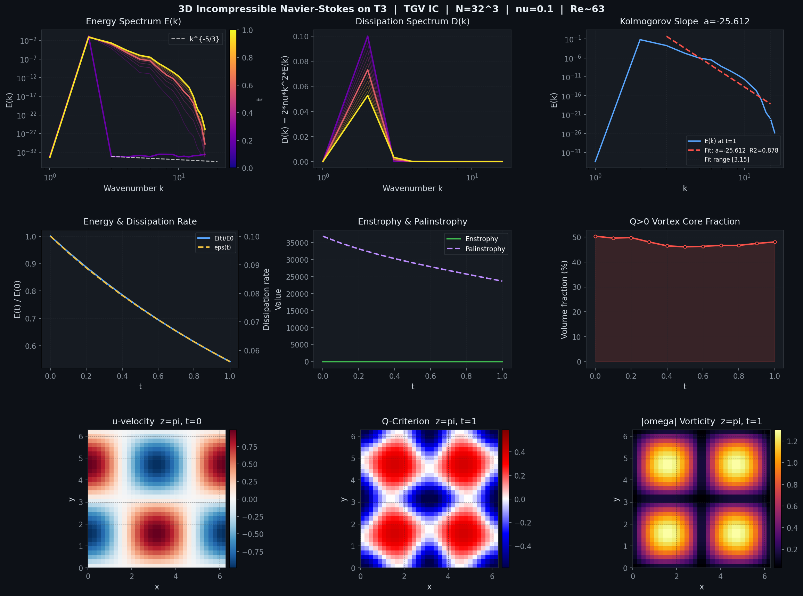

<p align="center">
  <h1 align="center">🌀 3D Navier–Stokes PINN Research Framework</h1>
  <p align="center">
    <em>Solving the incompressible Navier–Stokes equations with Physics-Informed Neural Networks on the periodic torus <strong>𝕋³ = [0, 2π]³</strong>, validated against an independent pseudo-spectral solver.</em>
  </p>
</p>

<p align="center">
  
  
  
  
  
</p>

---

## 📊 Results Preview

<p align="center">
  
</p>

<p align="center">
  <em>Reference solver results: Taylor–Green Vortex at Re≈63, N=32³. Shows energy spectrum evolution, dissipation, Kolmogorov slope fitting, enstrophy/palinstrophy dynamics, Q-criterion vortex identification, and vorticity magnitude fields.</em>
</p>

---

## 🔬 Scientific Scope

This is an **experimental scientific-computing project** for studying 3D incompressible
fluid dynamics using neural network approximation. All results are clearly labelled as:

- **Numerical approximation** — the neural network produces an approximate solution.
- **Numerical evidence** — repeated experiments show a particular behaviour.
- **Mathematical theorem** — a rigorous proof establishes a statement.

> **Disclaimer:** No computational result in this framework constitutes a proof of global regularity
> or a solution to the Navier–Stokes Millennium Prize problem.

## ✨ Key Features

| Feature | Description |
|---------|-------------|
| 🧠 **5 Neural Architectures** | Fourier-ResMLP, SIREN, Multiscale-MLP, DivFreeNet (∇·u=0 by construction), Standard MLP |
| 🔄 **Structural Periodicity** | Integer-wavenumber Fourier embedding guarantees 2π-periodicity — no boundary penalty needed |
| 📐 **Full AD Engine** | PyTorch autograd computes all PDE residuals (27 AD passes per batch) |
| 🧪 **Independent Validation** | Pseudo-spectral solver (NumPy only, RK4, Leray projection) — completely independent of PyTorch |
| 📊 **Spectral Diagnostics** | Energy spectrum E(k), Kolmogorov scaling, enstrophy, palinstrophy, Q-criterion |
| 🎯 **Adaptive Sampling** | Residual-based refinement (RAR) concentrates points where physics is hardest |
| ⏱️ **Curriculum Learning** | Causal time-window scheduling (Wang et al. 2022) |
| 🔁 **Full Reproducibility** | Seeds, hardware snapshots, config hashing — every experiment is one-command reproducible |
| ✅ **150 Tests** | Comprehensive test suite covering physics, numerics, models, and analysis |

## 🏗️ Architecture

```
Input (x,y,z,t)  →  Fourier Embedding [sin(k·r), cos(k·r), t/T]
                  →  Residual MLP (Linear → LayerNorm → Act → Linear + skip)
                  →  Output Head → (u, v, w, p)
                  →  AutoDiff → NS Residuals (R_u, R_v, R_w, R_c)
                  →  Loss = λ_PDE·L_PDE + λ_IC·L_IC + λ_div·L_div + λ_gauge·L_gauge
```

### The Navier–Stokes Equations (3D Incompressible)

```
Momentum:    ∂u/∂t + (u·∇)u + ∇p − ν∆u = 0
Continuity:  ∇·u = 0
```

---

## 🚀 Quick Start

```bash
# Clone and install
git clone https://github.com/YOUR_USERNAME/ns3d-pinn.git
cd ns3d-pinn
pip install -e .

# Run tests (150 tests, ~4 min)
pytest tests/ -v

# Run the demo — produces spectral analysis + 9-panel figure
python scripts/demo_results.py

# Run the reference solver
python scripts/run_reference_solver.py --config configs/experiment_01_baseline.yaml

# Train a PINN
python scripts/run_experiment.py --config configs/experiment_01_baseline.yaml

# Compare PINN vs reference solver
python scripts/compare_pinn_vs_ref.py \
    --config configs/experiment_01_baseline.yaml \
    --checkpoint results/baseline_tgv_low_re/checkpoints/ckpt_best.pt \
    --reference results/baseline_tgv_low_re/reference_solver.h5

# Reynolds number sweep
python scripts/sweep_reynolds.py --nus 0.1 0.05 0.02 0.01 --N 64
```

## 📁 Project Layout

```
ns3d-pinn/
├── configs/                 YAML experiment configs (schema-validated)
├── src/
│   ├── models/              Neural network architectures (5 variants)
│   │   ├── fourier_resmlp.py    Fourier-feature residual MLP (flagship)
│   │   ├── siren.py             SIREN (Sitzmann et al. 2020)
│   │   ├── multiscale_mlp.py    Multi-scale Fourier MLP
│   │   ├── divfree_net.py       Curl-of-potential (∇·u=0 by construction)
│   │   └── factory.py           Registry-pattern model builder
│   ├── physics/             PDE residuals & derivative engine
│   │   ├── derivatives.py       AD primitives: ∂/∂x, ∂²/∂x², ∇·, ∇×
│   │   ├── ns_residual.py       3D incompressible NS residuals
│   │   └── vorticity.py         Vorticity, enstrophy, energy spectra
│   ├── sampling/            Collocation point generation
│   │   ├── samplers.py          Uniform, LHS, Sobol quasi-random
│   │   └── adaptive.py          Residual-adaptive refinement (RAR)
│   ├── solvers/             Independent pseudo-spectral solver
│   │   ├── spectral_solver.py   RK4 + Leray projection + dealiasing
│   │   └── solver_io.py         HDF5 snapshot I/O
│   ├── training/            PINN training system
│   │   ├── loss.py              Multi-component loss function
│   │   ├── trainer.py           AdamW + cosine LR + checkpointing
│   │   └── curriculum.py        Causal time-window scheduling
│   ├── evaluation/          Quantitative metrics (PINN vs reference)
│   │   └── metrics.py           Rel. L2, divergence, energy, vorticity
│   ├── analysis/            Spectral & vortex diagnostics
│   │   ├── spectral_analysis.py E(k), Kolmogorov scale, dissipation
│   │   └── vortex_diagnostics.py Q-criterion, helicity, palinstrophy
│   └── utils/               Domain, ICs, precision, reproducibility
│       ├── domain.py            T³ grids, wavenumbers, periodicity checks
│       ├── initial_conditions.py TGV, ABC flow, Fourier random div-free
│       ├── precision.py         dtype resolution
│       └── reproducibility.py   Seeds, hardware snapshot, config hash
├── scripts/                 CLI entry points
│   ├── run_experiment.py        Train a PINN
│   ├── run_reference_solver.py  Run the spectral solver
│   ├── compare_pinn_vs_ref.py   Quantitative comparison + plots
│   ├── demo_results.py          Full demo with 9-panel figure
│   ├── sweep_reynolds.py        Reynolds number scaling study
│   └── analyze_results.py       Post-hoc spectral analysis
├── tests/                   9 test files, 150 tests
├── docs/images/             Figures for documentation
├── pyproject.toml           Package definition
├── requirements.txt         Pip dependencies
└── LICENSE                  MIT License
```

## 🧪 Initial Conditions

Three benchmark divergence-free flows are included:

| IC | Formula | Properties |
|---|---|---|
| **Taylor–Green Vortex** | u = V₀ sin(kx)cos(ky)cos(kz) | Classical DNS benchmark, vortex stretching |
| **ABC Flow** | u = A sin(z) + C cos(y) | Beltrami flow (ω = u), Lagrangian chaos |
| **Fourier Random** | u = ∇×A (vector potential) | Tunable spectrum E(k) ∝ k⁻ᵅ, reproducible |

All satisfy **∇·u = 0 analytically** (verified to < 10⁻¹² in tests).

## 📈 Milestones

| # | Description | Status |
|---|---|---|
| 1 | Periodic domain utilities | ✅ |
| 2 | Analytic divergence-free ICs | ✅ |
| 3 | PyTorch derivative engine | ✅ |
| 4 | Navier–Stokes residual | ✅ |
| 5 | Fourier-feature residual MLP | ✅ |
| 6 | Basic PINN training at low Re | ✅ |
| 7 | Pseudo-spectral reference solver | ✅ |
| 8 | Quantitative PINN vs. reference | ✅ |
| 9 | Adaptive sampling & curriculum | 🔄 |
| 10 | Increasing Reynolds number | 🔄 |
| 11 | Alternative architectures (SIREN, DivFreeNet, Multiscale) | 🔄 |
| 12 | Spectral & vorticity analysis | 🔄 |

✅ = Complete &nbsp; 🔄 = Code implemented, experiments in progress

## 🔧 Configuration

Experiments are defined via YAML configs. The [base config](configs/base.yaml) shows all defaults:

```yaml
model:
  type: "fourier_resmlp"
  fourier_modes: 8
  hidden_width: 256
  n_layers: 3
  activation: "tanh"

training:
  n_collocation: 20000
  max_epochs: 50000
  lr: 1.0e-3
  loss_weights:
    pde: 1.0
    ic: 10.0
    div: 1.0
    gauge: 1.0

physics:
  nu: 0.1  # Re ≈ 10
```

## 📚 References

- Taylor & Green (1937) — Taylor–Green vortex
- Raissi, Perdikaris & Karniadakis (2019) — Physics-informed neural networks
- Sitzmann et al. (2020) — SIREN
- Wang et al. (2022) — Causal training for PINNs
- Lu et al. (2021) — DeepXDE / Residual-adaptive refinement
- Brachet et al. (1983) — TGV DNS benchmarks
- Pope (2000) — *Turbulent Flows*

## 📄 Citation / Reproducibility

Every experiment saves: config file, seed, model checkpoint, training history,
hardware info, software versions, and evaluation metrics. Results are reproducible
from a single command.

## 📝 License

This project is licensed under the MIT License — see [LICENSE](LICENSE) for details.
